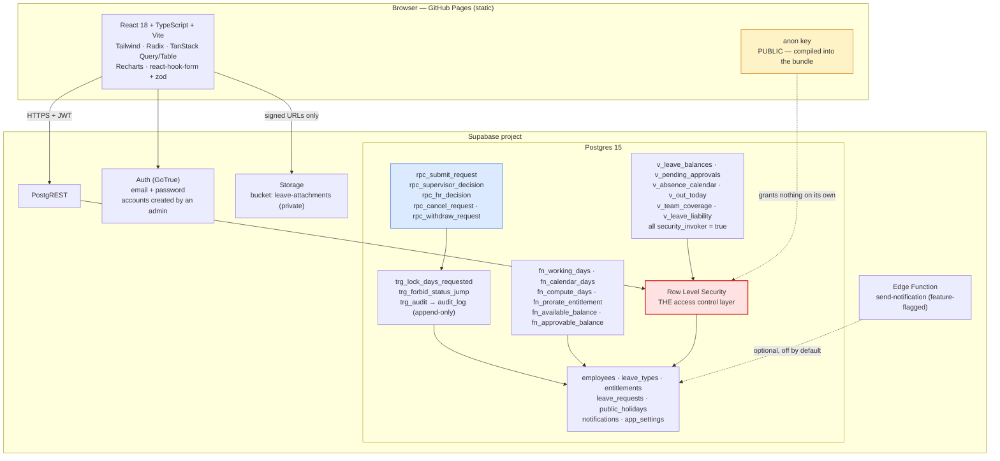
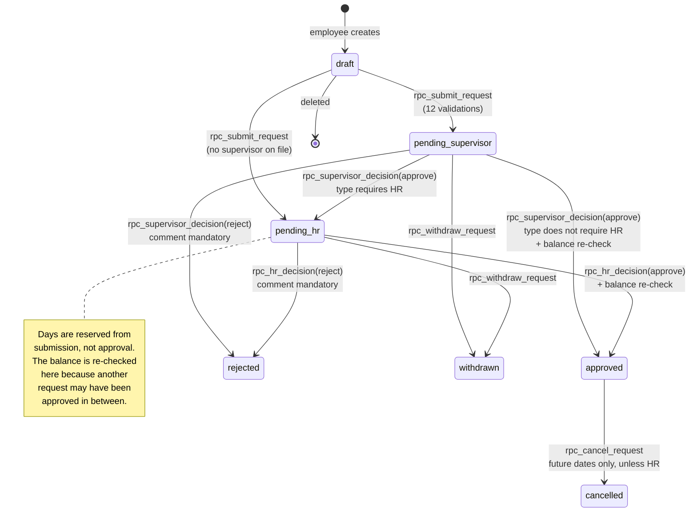

# CHAI Cambodia — Leave Management

A system of record for staff leave: entitlements, requests, a two-stage approval
workflow, an immutable audit trail, and the reporting that seventy separate Excel
workbooks cannot produce.

Replaces one-workbook-per-employee. Every view in the app is a query against a
single `leave_requests` table, so "who is out next Tuesday" and "what is our
accrued leave liability" are now questions with answers.

---

## Contents

- [What this fixes](#what-this-fixes)
- [Architecture](#architecture)
- [Repository layout](#repository-layout)
- [Setup](#setup)
- [Local development](#local-development)
- [Verification](#verification)
- [Deployment](#deployment)
- [Hosting limits and cost](#hosting-limits-and-cost)
- [Security model](#security-model)
- [Status and data protection](#status-and-data-protection)
- [Decisions for HR](#decisions-for-hr)
- [Known limitations](#known-limitations)
- [Deviations from the specification](#deviations-from-the-specification)

---

## What this fixes

Ten problems in the source workbook, and where each one is now handled.

| The problem in the spreadsheet | Where it is solved |
|---|---|
| One workbook per employee, no consolidated truth | A single `leave_requests` table; every screen is a query |
| Working days and calendar days summed in the same row (21 × 3 ≠ 90) | `leave_types.unit`; nothing in the system ever aggregates across units |
| Months as rows, with dates typed into a Notes column | `start_date` / `end_date` / `start_portion` / `end_portion` per request |
| No record of who approved what, or when | `leave_status` state machine plus an append-only `audit_log` |
| No public holiday table, so long leave was mis-counted | `public_holidays` and `fn_working_days()` |
| Merged three-row headers that no BI tool can read | Leave types are rows with a `parent_code` |
| Formulas hard-wired to 2026, pro-rating people hired years earlier | `fn_prorate_entitlement(hire_date, year, base_days, exit_date)` |
| `E4 = 0+0` — an unexplained manual adder | `entitlements.adjustment_days` with a mandatory reason and a recorded grantor |
| Scratch calculations sitting in live data cells | Plans are drafts; the balance view reports draft, pending and taken separately |
| Entitlements as floats (10.553424657534247) | Both pro-rata methods round to the nearest half day |

Two things the spreadsheet could not do at all, and this can:

- **Clash detection.** The request form lists teammates already approved for
  overlapping dates before you submit. For a field programme this is the single
  highest-value feature here.
- **Reserved pending balances.** A request that is waiting for approval already
  holds its days. Two requests that each fit the balance but do not fit together
  cannot both be approved — and the check is re-run *at the moment of approval*,
  not only at submission. See acceptance test D3.

---

## Architecture



Two rules the whole design rests on:

1. **No business logic in the client.** Day counts come from
   `rpc_preview_days`, balances from `v_leave_balances`, and every state
   transition from an `rpc_` function. The browser cannot compute a number that
   differs from the one that gets stored.
2. **No status change outside the RPCs.** `trg_forbid_status_jump` rejects any
   direct write to `status` or to the approval columns. Without it the entire
   approval workflow would be decorative: an employee could `UPDATE` their own
   row to `approved`.

### The approval workflow



---

## Repository layout

```
supabase/
  migrations/
    0001_extensions_and_enums.sql
    0002_tables.sql
    0003_rls_helpers.sql
    0004_business_functions.sql
    0005_triggers.sql
    0006_rpc.sql
    0007_views.sql
    0008_rls.sql
    0009_storage.sql
    0010_scheduling.sql
    0011_password_auth.sql
  seed.sql                       reference data + demo staff
  tests/rls_tests.sql            the RLS proof — 13 cases
  functions/send-notification/   optional email, off by default
  config.toml
src/
  lib/          supabase client, types, formatting, CSV/XLSX, errors
  hooks/        TanStack Query hooks and mutations
  providers/    AuthProvider
  components/   ui primitives, request form, date range picker
  pages/        login, my-leave, approvals, hr, calendar, admin
tests/
  unit/         pure functions, no database
  db/           acceptance suites A, B, C, D
scripts/
  import-legacy.mjs   Excel → database
  run-sql.mjs         runs .sql files via node-postgres (no psql needed)
  spa-fallback.mjs
docs/import/    CSV templates and the migration guide
.github/workflows/
  deploy.yml      test → build → GitHub Pages
  reminders.yml   stale-approval sweep (pg_cron fallback)
```

---

## Setup


### 1. Create the Supabase project

Region: Singapore (`ap-southeast-1`) is the closest to Phnom Penh.

Save the database password it shows you — it is needed in step 4 and cannot be
retrieved later, only reset.

### 2. Authentication: nothing to configure

Sign-in is email and password, administered from inside the app. There is no
identity provider to set up, no OAuth client to register, and nothing to ask an
IT department for.

Accounts are created by an administrator, who is shown a generated temporary
password to hand over. The holder is forced to replace it the first time they
sign in, and until they do, every other screen is blocked. Forgotten passwords
are handled the same way: Admin → Employees → **Reset**, which issues a fresh
temporary password and re-arms the forced change.

Two consequences worth knowing:

- **There is no self-service password reset**, because there is no email
  delivery configured. Someone with administrator access has to issue the reset.
  For a small organisation this is usually simpler than running SMTP; if you
  later want self-service, configure SMTP in Supabase and enable the built-in
  recovery flow.
- **Nobody can read anyone's password, including administrators.** Postgres
  hashes it on the way in. A reset replaces it; it never reveals it.

Optionally set `VITE_ALLOWED_EMAIL_DOMAIN` in `.env.local` to restrict sign-in
to a single email domain. Left unset, any address an administrator has created
an account for can sign in.

> The real access control is neither of those things. A signed-in user with no
> `employees` row can read nothing at all, and every row they *can* read is
> decided by Row Level Security. See "Security model".

### 3. Run the migrations, in order

```bash
npm run db:migrate
```

That applies every file in `supabase/migrations/` in numeric order, using the
connection details in `.env.local`. They are idempotent, so re-running is safe.

If you prefer the Supabase CLI and have Docker: `supabase link --project-ref
<ref>` then `supabase db push`. Or paste each file into the SQL editor in order.

### 4. Load the reference data

```bash
npm run db:seed
```

Sections 1–3 of `supabase/seed.sql` are reference data — settings, the 14 leave
types, and public holidays — and are safe anywhere. Sections 4–7 create eight
demo staff with a shared password and some demo requests; they belong on a test
project, not on anything holding real records.
### 5. Create the first administrator

Chicken and egg: accounts are created by an administrator, so the first one has
to be made outside the application.

Open **[docs/bootstrap-admin.sql](docs/bootstrap-admin.sql)**, change the values
at the top, and paste it into the Supabase SQL editor.

It does **not** call `rpc_admin_create_employee`. That function checks
`app_private.fn_is_hr()` explicitly, and the SQL editor has no signed-in user,
so the check fails regardless of what privileges the connection holds — being
the database owner bypasses Row Level Security, not an explicit guard inside a
function. The script calls the underlying helper instead, which is precisely why
that helper has EXECUTE revoked from every application role and is reachable
only from a direct database connection.

The script also generates your entitlements for the current leave year, so the
balances are populated rather than empty on first sign-in.

Then:

1. Sign in with that email and temporary password. You will be asked to choose
   your own straight away.
2. Admin → Public holidays → **Bulk import**, and load the official list. Do
   this before anything else: every day count depends on it.
3. Admin → Employees → **Add employee** for each member of staff. You will be
   shown a temporary password for each one. Or bulk-import — see
   [docs/import/README.md](docs/import/README.md).
4. Admin → Entitlements → **Generate entitlements** for the current year.

### 6. Configure the frontend

```bash
cp .env.example .env.local
```

Fill in `VITE_SUPABASE_URL` and `VITE_SUPABASE_ANON_KEY` from Supabase →
Project Settings (URL under **Data API**, key under **API Keys** — take the
`anon` / publishable one, never the secret), plus `PGHOST`, `PGPORT`,
`PGDATABASE`, `PGUSER` and `PGPASSWORD` from **Connect → Session pooler**.

---

## Local development

Two routes. Both need Node 20+.

**Against a hosted Supabase project — no Docker required.** This is the route to
take on a managed laptop, where WSL2 needs admin rights and Docker Desktop needs
a paid licence for an organisation of CHAI's size.

```bash
npm install
cp .env.example .env.local     # then fill in the values below
npm run db:migrate             # all ten migrations, in order, idempotent
npm run db:seed                # reference data + demo staff
npm run dev                    # http://localhost:5173/chai-leave/
```

`.env.local` needs `VITE_SUPABASE_URL`, `VITE_SUPABASE_ANON_KEY`, and the
database connection as discrete fields — `PGHOST`, `PGPORT`, `PGDATABASE`,
`PGUSER`, `PGPASSWORD`. Discrete fields rather than a `postgresql://` URI on
purpose: a Supabase-generated password routinely contains `/ * & @ $`, all of
which have meaning inside a connection string and would otherwise need
percent-encoding. Use the **session pooler** (port 5432), not the transaction
pooler — the RLS suite relies on `SET LOCAL` and explicit transactions.

**Against a local stack — needs Docker.**

```bash
npm install
supabase start          # applies every migration, then seed.sql
npm run dev
```

Every script detects which of the two you are on.

The seed creates eight demo staff in a four-level reporting tree covering every
role. Locally they can sign in with a password (email provider is enabled in
`supabase/config.toml` for exactly this reason):

| Email | Role | Notes |
|---|---|---|
| `sophea.chan@clintonhealthaccess.org` | system_admin | Country Director, no supervisor |
| `dara.pen@clintonhealthaccess.org` | hr_admin | HR & Operations Manager |
| `sokha.meas@clintonhealthaccess.org` | supervisor | 3 direct reports, 1 indirect |
| `rithy.norn@clintonhealthaccess.org` | supervisor | reports to Sokha |
| `chantha.ly@clintonhealthaccess.org` | employee | |
| `bopha.sok@clintonhealthaccess.org` | employee | |
| `vanna.chea@clintonhealthaccess.org` | employee | male, for the gender-gate tests |
| `sreymom.kim@clintonhealthaccess.org` | employee | hired 1 Jun 2026 — the pro-rating case |

Password for all of them: `demo-password-not-for-production`.

The login screen shows a **Developer sign-in** panel listing these accounts,
rendered only when `import.meta.env.DEV` is true so Vite strips it from
production builds. It saves typing an email and password on every reload; without
it you simply sign in normally.

---

## Verification

Three suites, in the order they should be run.

```bash
# 1. Row Level Security — 13 cases, ten that must fail and three that must pass
npm run db:rls

# 2. Acceptance suites A (day counting), B (pro-rating), C (workflow),
#    D (balance integrity) against the local stack
npm run test:db

# 3. Pure unit tests and the TypeScript build
npm test
npm run typecheck
```

`npm run db:rls` proves, by impersonating each role with
`set_config('request.jwt.claims', …)` and dropping into the `authenticated`
role, that all of the following **fail**:

1. Employee A reads Employee B's leave requests → 0 rows
2. Employee A reads anyone else's entitlements → 0 rows
3. Employee A sets their own request to `approved` → refused
4. Employee A shrinks their own `days_requested` → silently recomputed
5. Employee A writes their own `entitlements.adjustment_days` → refused
6. Supervisor S decides on a request outside their tree → refused
7. Supervisor S reads `audit_log` → 0 rows
8. Employee A sets `employees.role = 'hr_admin'` → refused
9. Anyone — employee, supervisor **or HR** — updates or deletes an audit row → refused
10. Employee A reads a storage object under another employee's prefix → 0 rows

…and that these **succeed**:

11. HR reads all eight seeded employees
12. A supervisor reads their three direct reports' balances, and the indirect one
13. Employee submits → supervisor approves → HR approves, and the available
    balance falls by exactly `days_requested`

The acceptance suites cover every case in section 10 of the specification:
A1–A7, B1–B5, C1–C7, D1–D9, plus extras (half-day holidays, both pro-rata
methods landing on whole halves, `min_notice`, and the working-day/calendar-day
separation).

> **Status.** All three suites have been run green against a hosted Supabase
> project: 13/13 RLS checks, 39/39 acceptance tests, 35/35 unit tests, plus a
> clean `tsc --noEmit` and a successful production build. The CI workflow runs
> all of them and blocks the deploy if any fails.
>
> Running them found five real defects that review had not: a circular
> `@apply` that broke the build, a psql dependency that made `db:rls`
> unrunnable without Docker, unqualified enum types inside functions declared
> `SET search_path = ''`, `NULL` token columns on hand-inserted `auth.users`
> rows that made every sign-in fail, and a test that depended on file execution
> order. None were visible without executing the code.

---

## Deployment

`.github/workflows/deploy.yml`, on push to `main`:

1. **unit** — `npm run typecheck` and `npm test`
2. **database** — `supabase start` (every migration plus the seed),
   `npm run db:rls`, `npm run test:db`
3. **build** — needs both of the above; also greps `dist/` for the string
   `service_role` and fails if it appears
4. **deploy** — publishes `dist/` to GitHub Pages

Set two **repository variables** (Settings → Secrets and variables → Actions →
*Variables*, not Secrets):

- `VITE_SUPABASE_URL`
- `VITE_SUPABASE_ANON_KEY`

### Why variables and not secrets

The anon key is compiled into the JavaScript that GitHub Pages serves to the
public internet. Anyone can open dev-tools and read it. Putting it in Actions
Secrets would hide it from the repository settings page while leaving it in plain
sight in the bundle — which is worse than not hiding it, because it invites
somebody to assume the key is a control. It is not. **Row Level Security is the
control.** Storing the key as a variable states that honestly.

`SUPABASE_SERVICE_ROLE_KEY` *is* a real secret. It bypasses RLS entirely. It
lives only in Actions Secrets (used by `reminders.yml`) and in your shell when
running the one-off import. It must never appear in this repository, in `.env`,
or in any frontend code.

### GitHub Pages settings

Settings → Pages → Source: **GitHub Actions**.

Routing uses `HashRouter`, so no server rewrite is needed. The build also copies
`index.html` to `404.html` so an old bookmarked path lands on the app rather
than GitHub's 404 page.

---

## Hosting limits and cost

Both halves run on free tiers. The figures below were measured on
**2026-09-01**, against a database holding 14 employees, 11 leave requests and
175 entitlement rows.

### Supabase free plan

| Limit | Free plan | Measured | Verdict |
|---|---|---|---|
| Database size | 500 MB | 14 MB | 2.8% used |
| File storage | 1 GB | 0 MB (no attachments yet) | fine |
| Egress | 5 GB/month | API JSON only; static assets are served by Pages | fine |
| Monthly active users | 50,000 | 14 | irrelevant at this scale |
| Edge function calls | 500,000 | 0 (`send-notification` not deployed) | fine |
| Realtime connections | 200 | 0 — the app does not use Realtime | fine |
| Active projects | 2 | 1 | one spare |
| **Idle pausing** | **paused after ~1 week** | — | **see below** |
| **Backups** | **none** | — | **see below** |
| Point-in-time recovery | not offered | — | `$100/month` on Pro; not needed |
| Log retention | 1 day API/DB, 1 hour auth | — | `audit_log` is in Postgres, so it is permanent |
| Support | community forum | — | no SLA |

### GitHub free plan

| Limit | Free plan | Measured |
|---|---|---|
| Published site size | 1 GB | 1.5 MB |
| Bandwidth | 100 GB/month (soft) | negligible at 70 staff |
| Deployment timeout | 10 minutes | build takes about 1 minute |
| Actions minutes | unlimited on **public** repositories | ~5 minutes per push, most of it the `database` job |
| Pages on a private repo | requires a paid plan | not applicable — this repo is public |

### How fast the database grows

`audit_log` is the only table that grows without bound, at **1.11 kB per row**.
At 70 staff, expect roughly **5-8 MB a year** including entitlements. The 500 MB
cap is therefore decades away. Database size is not the constraint; the two
below are.

### The three limits that actually matter

1. **The project pauses after about a week of inactivity.** A leave app has
   genuinely quiet weeks - Khmer New Year, Pchum Ben. The first person back gets
   an error page, not a slow one, and somebody must open the Supabase dashboard
   and click **Restore**. Staff get no warning and there is no automatic
   wake-up. This is the most likely way the system embarrasses whoever rolled it
   out.
2. **There are no backups.** Not "backups that are awkward to restore" - none.
   Delete an employee and their entitlements cascade away with them. `audit_log`
   records *that* it happened, which is not the same as being able to undo it.
   Pro includes 7 days.
3. **The source is public**, because Pages on a private repository needs a paid
   GitHub plan. That is safe by design - the anon key is meant to be public and
   RLS is the real control - but it is why no password may ever be committed,
   and why `scripts/check-bundle.mjs` fails the build if the demo password
   reaches `dist`.

### One clause to know about

GitHub Pages' terms prohibit "processing sensitive transactions such as
passwords" and running commercial SaaS. This case reads as compliant on both
counts: Pages serves static files only, credentials go straight to Supabase, and
this is an internal nonprofit tool rather than a commercial service. But a system
holding sick-leave records is being hosted on a free consumer tier, and if CHAI
ever reviews this formally, that is the clause someone will point at. Better to
know before it is raised.

### What USD 25/month changes

Pausing stops. Backups appear (7 days). Database goes to 8 GB, storage to
100 GB, log retention to 7 days, and support becomes email rather than a forum.

For testing, the free tier is the right choice. Before real staff leave depends
on this, items 1 and 2 above are the two that should not be accepted - and
USD 300 a year is still roughly a fifth of the cheapest commercial leave tool,
none of which model working-day and calendar-day units in one system anyway.

---

## Security model

**The anon key is public.** It ships inside the bundle. Row Level Security is
therefore not one layer of defence — it is the *only* one. If a policy is wrong,
health-adjacent HR data is world-readable to anyone who reads the JavaScript.

What that means in practice:

- Every table has RLS enabled. `anon` is granted nothing at all: there is no
  public data here.
- Every view is `security_invoker = true`, so base-table policies still apply. A
  view must never be a hole in the fence.
- Policy helpers (`fn_is_hr`, `fn_is_descendant_of`, …) live in a private schema
  that is not exposed through PostgREST, are `SECURITY DEFINER` with a pinned
  `search_path`, and are the reason the `employees` policy does not recurse into
  itself.
- Reporting-line visibility is a recursive walk up `supervisor_id`, depth-capped
  at 20, so a data-entry cycle cannot hang a query. A country director sees the
  whole tree beneath them.
- `audit_log` has a SELECT policy for HR and **no** UPDATE or DELETE policy for
  anybody, ever. `INSERT`, `UPDATE` and `DELETE` are revoked from
  `authenticated` outright; rows arrive only through the `SECURITY DEFINER`
  audit trigger.
- Colleagues cannot read each other's `employees` rows — hire dates and the
  gender flag are nobody else's business. The team calendar and the clash
  warning go through `rpc_team_absences`, a deliberately narrow projection of
  names and dates only, scoped to the caller's department plus their subtree.
- `days_requested` is overwritten by a trigger on every insert and update. A
  client cannot set it, shrink it, or round it in its own favour.
- Only a `system_admin` may change `employees.role`, enforced by a trigger
  because a policy cannot see which column changed.
- Attachments live in a private bucket under `{employee_id}/{request_id}/`.
  There are no public URLs; the app issues signed URLs valid for 60 seconds.

---

## Status and data protection

**This is a personal project, built for learning and testing. It is not a CHAI
system, is not connected to any CHAI infrastructure, and holds no real staff
data.** The leave rules and the brand styling are modelled on CHAI's because
that is the problem being solved; nothing here has been reviewed or approved by
anyone at CHAI.

Keep it that way until the questions below have real answers.

### Before this could hold anyone's actual records

Sick leave, mental health days and maternity records are **health-adjacent
personal data**. Three things would need settling first, none of them technical:

1. **Where it may be hosted.** A Supabase project sits outside CHAI's Microsoft
   365 tenancy. Whether that is permitted for staff health-adjacent data is a
   question for whoever owns information governance — and if the answer is no,
   the stack changes rather than the app: Power Apps on Dataverse or SharePoint
   is the equivalent on an existing M365 licence.
2. **Who may see what, agreed with HR rather than inferred.** The model here —
   you, your reporting line, and HR — is a reasonable default, not a policy
   anyone has signed off.
3. **Retention.** Nothing is ever deleted. The audit log is deliberately
   append-only and there is no purge routine, which is right for an audit trail
   and wrong for personal data with a retention limit.

### What the design does to limit exposure anyway

- `gender` exists only to gate maternity and paternity leave, is never displayed,
  and can be left blank — the gate simply will not apply.
- Mental Health Day requires no reason and never requests a document.
- Medical certificates sit in a private bucket, reachable only by the owner,
  their reporting line, and HR, through signed URLs valid for 60 seconds.
- Colleagues cannot read each other's `employees` rows at all. The team calendar
  goes through a deliberately narrow function returning names and dates only.
- The reason field is visible to the approver and HR. The UI tells staff that
  most leave types do not require one.
- Every read path is bounded by Row Level Security; every write is recorded in
  `audit_log` with the actor's id and email.
- Passwords are hashed by Postgres. Administrators can reset one but can never
  read it.

---

## Decisions for HR

Three things the application deliberately does not decide on HR's behalf.

**1. The pro-rata method.** `app_settings.prorate_method`:

| Method | 1 June 2026 hire, 18-day entitlement | Explainable in one sentence? |
|---|---|---|
| `monthly_accrual` — 1.5 days per completed month | **10.5** | Yes: "one and a half days for every full month you have worked" |
| `daily_365` — 18 × days employed ÷ 365, rounded to 0.5 | **10.5** | Less so, but it matches the old workbook's 10.553 |

Both are implemented; both land on 10.5. Show HR the two columns and let them
choose. That is the difference between "the analyst changed our numbers" and
"the analyst gave us the decision."

**2. Carry-forward expiry.** Annual leave carries up to 5 days into the next
year, expiring 31 March (`max_carry_forward`, `carry_forward_expiry_month`). The
convention the code applies — and it *is* a convention, not a law — is that
carry-forward is consumed first: after the expiry date, any carried days not
already used by leave starting on or before 31 March drop out of the pool.
Confirm HR agrees.

**3. The undocumented `O14:P24` block** in the source workbook (Jan 1.5, Aug 1,
Sep 1, Oct 2, Nov 3, Dec 5). It could be planned leave, public holidays, or last
year's leftovers — the file does not say. If it is a leave plan it totals 13.5
days against a 10.55-day entitlement, roughly three days over-booked with no
warning anywhere. Ask before migrating it. Nothing in this repository assumes an
answer.

---

## Known limitations

- **Public holiday dates are estimates, not authority.** The fixed-date holidays
  (1 Jan, 8 Mar, 14–16 Apr, 1 May, 14 May, 18 Jun, 24 Sep, 15 Oct, 29 Oct,
  9 Nov) recur reliably. The lunar ones — Meak Bochea, Visak Bochea, the Royal
  Ploughing Ceremony, Pchum Ben, the Water Festival — move every year, and the
  seeded values were derived from the lunar calendar, **not** from a sub-decree.
  They are marked `-- LUNAR: estimate` in `seed.sql`. Verify the whole list
  against the official Royal Government of Cambodia sub-decree annually, before
  the year begins. A wrong holiday silently miscounts every piece of leave that
  spans it.
- **The Supabase free tier pauses a project after about seven days of no
  activity, and takes no backups.** Both are covered in full under
  [Hosting limits and cost](#hosting-limits-and-cost). Raise them with your
  supervisor *before* rollout.
- **`pg_cron` is not available on the free tier**, so the stale-approval
  reminder falls back to `.github/workflows/reminders.yml`. Both call the same
  function and it is idempotent, so running both is harmless.
- **Average days to decision** on the HR dashboard measures the *live* queue,
  not a historical average of closed requests. The audit log holds the data for
  a true historical figure; it is not surfaced yet.
- **Email is not wired up.** In-app notifications work. Email exists only as a
  feature-flagged Edge Function so it can be pointed at CHAI's relay later
  without touching the app.
- **No offline support.** Field staff on a poor connection can submit from a
  phone, but the app needs a connection to do it.
- **`v_team_coverage` covers a rolling window** of 30 days back to 120 days
  forward, weekdays only, to keep the query bounded.
- **Balances across units must never be summed.** The HR table shows working-day
  and calendar-day rows side by side because HR needs to see both; adding them
  together is the exact bug this system replaced, and no view in the app does it.

---

## Deviations from the specification

Three, all deliberate, all for the better.

1. **`CHECK (days_requested >= 0)`, not `> 0`.** A draft covering only a weekend
   has to be *storable*, so that `rpc_submit_request` can refuse it with
   "Selected dates contain no working days." rather than a raw constraint
   violation. Submission enforces `> 0`. Acceptance test A7b covers both halves.
2. **`fn_approvable_balance` alongside `fn_available_balance`.** Submission
   reserves pending days; approval must not, or the first of two pending
   requests could never be approved. Approval therefore checks entitlement minus
   *approved* days. This is what makes test D3 pass with the correct outcome —
   first approval succeeds, second is refused — rather than deadlocking both.
3. **`rpc_team_absences` for the calendar and the clash warning.** The
   `employees` SELECT policy in the spec (self, subtree, HR) correctly stops
   colleagues reading each other's records — but the team calendar and the
   "who else is off then" warning need cross-team visibility. Rather than widen
   the policy and leak hire dates and the gender flag, there is one narrow
   `SECURITY DEFINER` function returning names and dates only. The employees
   policy also permits reading your own supervisor's row, so the app can name
   the person holding your request.

Additions beyond the specification: `rpc_withdraw_request` (the spec's UI asks
for a withdraw action but names no RPC), `is_requestable` on `leave_types` (so
`SPECIAL` can be a category heading without being requestable),
`request_ref_counters` with an atomic reference generator, carry-forward expiry
enforcement in the balance functions, a supervisor-cycle trigger, and
`coverage_risk_threshold` in `app_settings` so the 30% figure is configurable
rather than hard-coded.

---

## Licence and ownership

Internal CHAI Cambodia tool. Not for redistribution.
